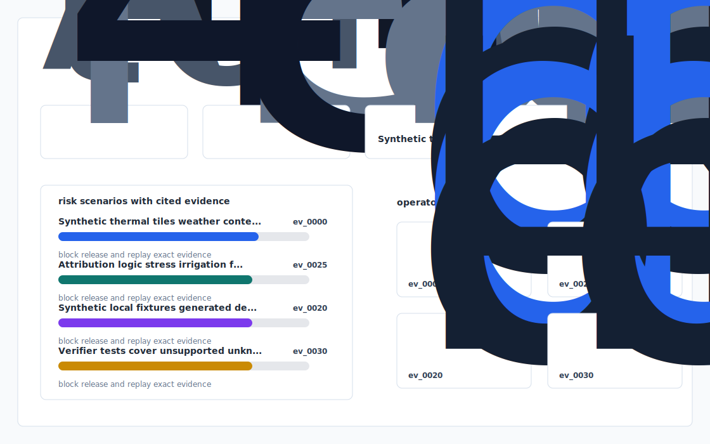

# Thermal Event Attribution Workbench


A local physical-world analytics prototype for attributing synthetic thermal anomalies to decision-grade event categories with evidence trails.

`constellr-thermal-event-attribution` favors explicit fixtures, deterministic checks, and reviewable artifacts over hidden services or live data.

## Why this exists

Thermal Event Attribution Workbench for Agriculture and Infrastructure.

## System behavior

- Synthetic thermal tiles, weather context, anomaly bands, and intervention signals.
- Attribution logic for crop stress, irrigation failure, equipment risk, and heat events.
- Structured reports, CSV outputs, and an offline dashboard for review.

## Runbook

```bash
uv sync
uv run app init-demo
uv run app ingest fixtures/
uv run app analyze
uv run app verify
uv run app dashboard
uv run app benchmark
uv run app export-demo-pack
uv run pytest -q
uv run ruff check .
```

## Inspection points

- `outputs/dashboard.html`
- `outputs/decision_report.md`
- `outputs/evidence_graph.mmd`
- `outputs/risk_or_quality_report.csv`
- `outputs/benchmark.md`
- `outputs/demo_pack.md`

## Verification

```bash
uv run ruff check .
uv run pytest -q
uv run app verify
```

## Privacy model

The `constellr-thermal-event-attribution` public surface is source, tests, lockfile, and docs. It does not need credentials, browser state, customer records, or hosted services.


